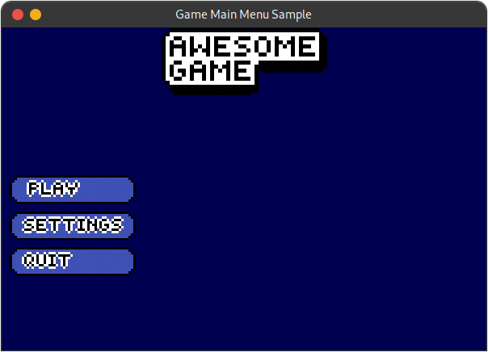

========================
My personal game library
========================

This is my own "game engine" I made to create small games to practise
my game development skills. It's not a complex project, it just has
some code here and there to handle:
* scenes
* interface objects (i.e buttons, labels etc)
* backgrounds
* animations

Requirements
============

* python >= 3.7
* pygame >= 1.9.6

Demonstration
=============

Fully main menu sample

Authors
=======

* Me
* A random friend of mine (She helped me with the pixel art of 
  the cat)
