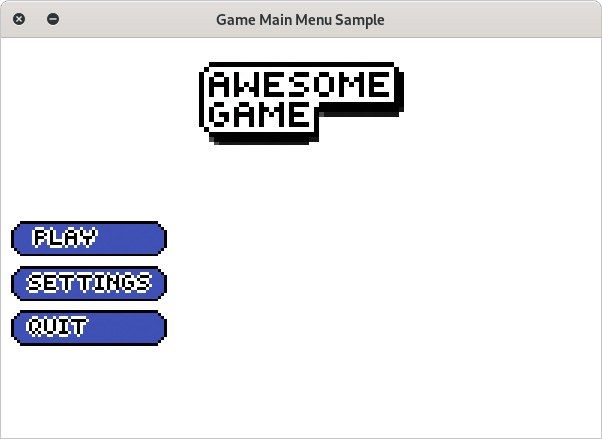

=======================
Game Main Menu Template
=======================

Since I did have a lot of free time, I decided to create a kind of
main menu. In this app, basically I've implemented some animations
and special effects on it. Like a fade-in and fade-out.

Requirements
============

* python >= 3.7
* pygame >= 1.9.6

Demonstration
=============

Authors
=======

* Me
* A random friend of mine (She helped me with the pixel art of 
  the cat)
